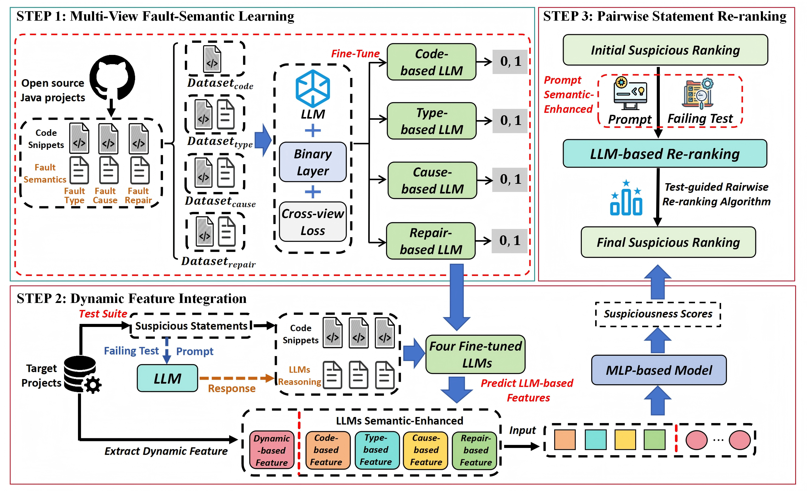

# FaultScape: Project-Scale Statement-Level Fault Localization via Multi-View Semantic Learning and Pairwise Reranking

FaultScape is a project-scale statement-level fault localization framework that combines multi-view LLM semantic learning with pairwise reranking. It constructs four semantic views for suspicious statements, learns view-specific representations, integrates them with dynamic features, and then reranks suspicious candidates to improve final localization performance.

## Overview



The full pipeline contains five stages:

1. Download the released dataset.
2. Construct four multi-view datasets.
3. Fine-tune four view-specific LLMs.
4. Integrate semantic and dynamic features to obtain the initial FL ranking.
5. Perform pairwise reranking on Top-K suspicious statements.

## Repository Structure

```text
FaultScape/
|-- FaultScape_data/
|   |-- Multi-view_Dataset_Construct.py
|   `-- Multi-view_data/
|-- LLM_FL_Result/
|   |-- workflow.png
|   `-- FL/
|       |-- LLM_fine_tune/
|       |-- ranking_task/
|       |-- pairwise_rerank/
|       `-- run_FL_Result.sh
`-- README.md
```

## Run FaultScape

> **Quick start (reproduce experimental results efficiently):**  
> Only **Step 4 (Dynamic Feature Integration)** and  **Step 5 (Pairwise Statement Reranking)** are required.

### Minimal Commands

```bash
# Step 4: integrate semantic + dynamic features for initial ranking
sh LLM_FL_Result/FL/run_FL_Result.sh

# Step 5: LLM-based pairwise reranking
python LLM_FL_Result/FL/pairwise_rerank/run_rerank.py
python LLM_FL_Result/FL/pairwise_rerank/ranking_merge_FL_result.py
```

### 1. Download the Dataset

Download the required dataset from Mega:

[Download Dataset from Mega](https://mega.nz/folder/HygxxJIQ#ESnCieZAgmCI1T4l4jxTRQ)

After downloading, place all required files under:

```text
FaultScape_data/Multi-view_data/
```

### 2. Construct the Multi-View Datasets

FaultScape constructs four multi-view datasets:

- `code_fl_data`
- `type_fl_data`
- `fix_fl_data`
- `cause_fl_data`

Each dataset contains about 780k instances.

Run:

```bash
python FaultScape_data/Multi-view_Dataset_Construct.py
```

### 3. Reasoning-Enhanced Fine-Tuning

Fine-tune the four view-specific models and generate multi-view semantic features.

Run:

```bash
python LLM_FL_Result/FL/LLM_fine_tune/Llama_3_Multi-view_Fine_tune.py
```

The generated semantic features are saved to:

```text
LLM_FL_Result/FL/ranking_task/LLM_semantic.pkl
```

Notes:

- The fine-tuning script expects the four JSON datasets to be available under `./Multi-view_Datasets/`.
- Please ensure the environment includes the required dependencies such as `torch`, `transformers`, `datasets`, `peft`, and `unsloth`.

### 4. Dynamic Feature Integration

This stage combines multi-view semantic features with dynamic features and produces the initial fault localization ranking.

Run:

```bash
sh LLM_FL_Result/FL/run_FL_Result.sh
```

This script executes:

- `LLM_FL_Result/FL/ranking_task/gen_data_for_MLP.py`
- `LLM_FL_Result/FL/ranking_task/run_model/run_group.py`

### 5. Pairwise Statement Reranking

This stage reranks the Top-K suspicious statements from the initial ranking using LLM-based pairwise comparison.

First, configure your LLM in:

```text
LLM_FL_Result/FL/pairwise_rerank/config.py
```

Then run:

```bash
python LLM_FL_Result/FL/pairwise_rerank/run_rerank.py
python LLM_FL_Result/FL/pairwise_rerank/ranking_merge_FL_result.py
```

Results:

- `run_rerank.py` performs pairwise reranking and saves intermediate inference outputs.
- `ranking_merge_FL_result.py` merges reranking outputs and produces the final ranking results.

The prompt template used for reranking is stored in:

```text
LLM_FL_Result/FL/pairwise_rerank/prompt_template.txt
```

## Output Summary

Important intermediate and final outputs include:

- Multi-view datasets under `FaultScape_data/`
- Multi-view semantic features in `LLM_FL_Result/FL/ranking_task/LLM_semantic.pkl`
- Initial FL ranking results under `LLM_FL_Result/FL/ranking_task/run_model/`
- Pairwise reranking results under `LLM_FL_Result/FL/pairwise_rerank/`

## Notes

- Some scripts use relative paths internally, so running commands from the repository root is recommended.
- If you use an external LLM service for reranking, update the settings before execution.
- Keeping the current directory structure unchanged will help avoid path-related issues.

